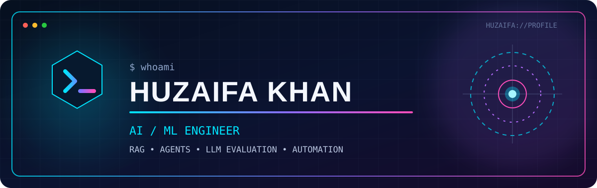

<div align="center">



### AI Engineer building reliable RAG systems, intelligent agents, and products that ship.

[](https://www.linkedin.com/in/muhammad-huzaifa-6b396a26a/)
[](https://x.com/Huzaifa_khn_)
[](https://www.youtube.com/@CodeRoad-k7k)


</div>

```yaml
name: Huzaifa Khan
role: AI / ML Engineer
location: Karachi, Pakistan
focus: [RAG, AI Agents, LLM Evaluation, Business Automation]
currently_building: Production-ready AI products
open_to: [Freelance Projects, Collaborations, Co-founder Conversations]
```

## Selected work

| Project | What it does | Stack |
|---|---|---|
| [NeuroFlow — FYP](https://github.com/mohdhuzkhn/NeuroFlow-Fyp-Project) | Computational hemodynamics platform for cerebral aneurysm rupture-risk assessment using medical imaging, flow simulation, and clinical scoring | DICOM/MRA · Navier–Stokes · 2D/3D Visualization |
| [AI Text Evaluation](https://github.com/mohdhuzkhn/NLP-Project-AI-Text-Eval) | NLP project for evaluating AI-generated text and analyzing model output quality | NLP · AI Evaluation · Python |
| [Financial RAG](https://github.com/mohdhuzkhn/RAG-App-Financial) | Anti-hallucination RAG for 10-K/10-Q filings with parent-child retrieval and RAGAS evaluation | Python · RAG · RAGAS |
| [AI Leads Generation](https://github.com/mohdhuzkhn/AI-Leads-Generation) | Discovers companies, enriches decision-makers, and scores leads through a multi-agent pipeline | CrewAI · FastAPI · Next.js |
| [AI Learning OS](https://github.com/mohdhuzkhn/AI-Powered-Learning-OS) | Mission-driven, project-based learning platform with scalable application architecture | React · TypeScript · Firebase |
| [AI Backend CI/CD](https://github.com/mohdhuzkhn/ai-backend-ci-cd) | Production FastAPI pipeline with linting, matrix tests, service containers, and Docker builds | FastAPI · Docker · GitHub Actions |
| [Exam Paper Agent](https://github.com/mohdhuzkhn/RAG-App-Education) | Creates structured exam papers from PDFs, images, and spreadsheets, then exports Word documents | Python · Streamlit · Gemini |

## System stack

<div align="center">


</div>

`AI` LLMs · RAG · Agentic workflows · Prompt engineering · Model evaluation · Fine-tuning  
`Backend` Python · FastAPI · Django · PostgreSQL · Redis  
`Product` TypeScript · React · Next.js · Streamlit · Firebase · Supabase  
`Delivery` Docker · GitHub Actions · CI/CD · Git

## Current signals

<div align="center">


</div>

## Beyond the code

I’m a Computer Science student at the University of Karachi, turning AI research into usable products. I’m especially interested in retrieval quality, grounded generation, agent workflows, and automation that removes repetitive work from real businesses.

I also run [Code Road](https://www.youtube.com/@CodeRoad-k7k), where I break down computer science and programming concepts for students.

<div align="center">

### Let’s build something useful.

[Start a conversation on LinkedIn](https://www.linkedin.com/in/muhammad-huzaifa-6b396a26a/) · [Explore my repositories](https://github.com/mohdhuzkhn?tab=repositories) · [Watch Code Road](https://www.youtube.com/@CodeRoad-k7k)

<sub>Build things that matter · Ship · Learn in public</sub>

</div>
